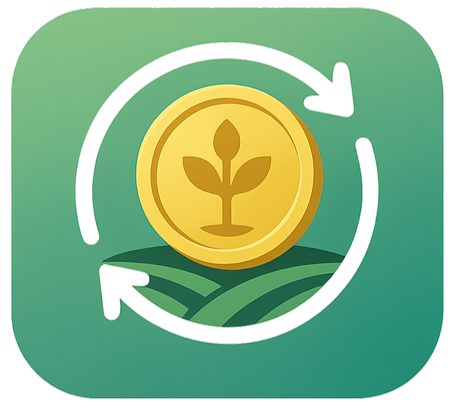

<h1>  AgriCircularToken Dapp</h1> 

AgriCircularToken è una semplice Web DApp che emette un token ERC‑20 personalizzato (ACT) sulla testnet Ethereum Sepolia.  
L'applicazione consente agli utenti di accumulare token registrando attività sostenibili e di spenderli per ottenere badge, acquistare dei corsi informativi o contribuire a progetti ecologici.

## Requisiti

- Estensione [MetaMask](https://metamask.io/) installata nel browser
- Connessione alla rete Sepolia da MetaMask
- ETH di test disponibili nel wallet

##  Avvio della DApp

### - Modalità online

È possibile accedere alla DApp direttamente dal seguente link:

🔗 [https://valentinamilighetti.github.io/ACT-Dapp-DSB/](https://valentinamilighetti.github.io/ACT-Dapp/)

---

### - Modalità locale

Per eseguire il progetto localmente:

1. Assicurati di avere installato [Node.js](https://nodejs.org/)
2. Apri il terminale nella cartella del progetto
3. Esegui il seguente comando:

```bash
npx http-server
```
Apri il browser su http://localhost:8080


## N.B 
Per tutti i dettagli visualizza il documento di progetto [ACT_Dapp_documento.pdf](./ACT_Dapp_documento.pdf)
